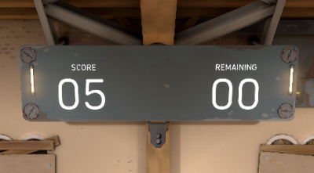

# OCR Statistics Recorder
This project is intended for people who play Riot Games' tactical shooter, Valorant. The program records the user's score into a file when practicing in the "Shooting Range" to keep track of the user's overall improvement in the Range.

## Requirements
* Windows 10
* Ability to change windows when in-game (Alt+Tab)

## Installation
1. Download the latest release [here](https://github.com/vincentvilo/ocr-stats-recorder/archive/v1.0.zip).
2. Unzip the files.

The following steps are optional but **recommended**: 

3. Navigate to the directory "dist/range_recorder/" within the unzipped files.
4. Create a shortcut for "range_recorder.exe" (Right click "range_recorder.exe" > Create shortcut) 
5. Move shortcut onto desktop for convenience.

## Usage
1. Start "VALORANT.exe".
2. Navigate to the Shooting Range (Play > Practice > Shooting Test > Enter Range)
3. Start "range_recorder" by clicking on the desktop shortcut OR navigating to "dist/range_recorder/range_recorder.exe"
    * If starting the program creates a "dangerous file" prompt, click "More info," then click "Run anyway".
4. Wait for program to output "RANGE RECORDER HAS STARTED!"
5. Start practicing! Range scores are recorded in "dist/range_recorder/output_files/scores.csv" while the recorder window is open.
    * You only have to run the program once for multiple sessions.
6. To exit out of the recorder, press 'ESC' before/after shooting the "START" button in-game.
Scores are saved in "dist/range_recorder/output_files/scores.csv"

## Concepts Used
* optical character recognition ([OCR](https://en.wikipedia.org/wiki/Optical_character_recognition))
* HSV color detection
## Version History
The project went through different versions based on how accurately the program would read the user's score in the Practice Range.
### v0.1: Screenshot of Scoreboard Region

Initially took a screenshot of the region where the scoreboard _should_ be. This method was unreliable since the region might depend on the size of the user's screen, and the user would have to aim at a specific point in order for the image to be detected.
### v1.0: Scoreboard Detection with HSV Filters

Used HSV color detection to find the largest contour of a certain color. In this case, the HSV algorithms were tuned to search for a color similar to the scoreboard, and the largest contour that appeared was the scoreboard. 

Proved to be more reliable than taking a screenshot of the center. However, the user would have to use similar display settings as the developer to ensure the color is recognized. For example, using a colorblind mode might change the shade or intensity of the scoreboard's color, which would lead to an inaccurate screenshot of the scoreboard.
## Future Plans
* Add script to create a graphical representation for the scores.
* Improve accuracy of reading the scoreboard. 
* Add customized options for the program to work with the user's display settings (i.e. colorblind options).
* Track overshooting/undershooting when aiming at the bots; could help users improve their aim.
* Webpage to create a leaderboard among the Valorant community.

